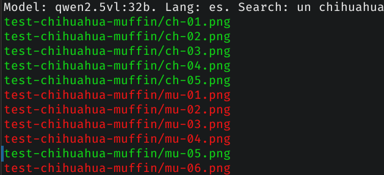

# find-in-images

A Python script that allows you to search for images containing specific content.

The script does not index images or search by metadata; each image is evaluated individually using a visual model.

## Requirements

- Access to an `Ollama server`, either local or remote.
- A `visual model` available in Ollama that is capable of processing images.
- `ffmpeg` installed, used to downscale images before processing them.

## How to use (quick start)

Before running the script, edit the `config.ini` file and adjust mainly these two values:

```ini
model = qwen3-vl:8b
subject = a chihuahua
lang = en
```

In `model`, specify a visual model that you have installed in Ollama.

In `subject`, specify what you want to search for. Make sure it matches the language defined by `lang`.

Run the program using:

```bash
python find-in-images.py <file1> <...> <fileN>
```

or by using a glob pattern such as `test-chihuahua-muffin/*`, as shown in the example.



Images that match the condition will be written to the `out.log` file (default name). If the model returns an ambiguous response, the file name will be prefixed with a `?`.

On the terminal:
- matching images are shown in green
- non-matching images in red
- images with an ambiguous model response in yellow

## How to use (advanced)

### Custom prompt

If the default prompt does not work well for your use case, or if you want to use another language, you can add your own prompt using the `prompt XX =` key in `config.ini`, where `XX` is the language code. An example is provided in the file.

### Processing a list of files

If you already have a list of files, you can pipe it into `find-in-images`:

```bash
cat your-file-list.txt | python find-in-images.py
```

### Using Linux `find`

The most powerful option is to use `find` to locate all images within a directory and its subdirectories:

```bash
find /your/path -type f \( -iname "*.png" -o -iname "*.jpg" -o -iname "*.jpeg" \) | python find-in-images.py
```

## Known limitations

- The results are not 100% deterministic
- Large models can be slow
- Execution time depends on the model and whether CPU or GPU is used
- Results depend heavily on the prompt

## License

This code is released under the GPLv3 license.
